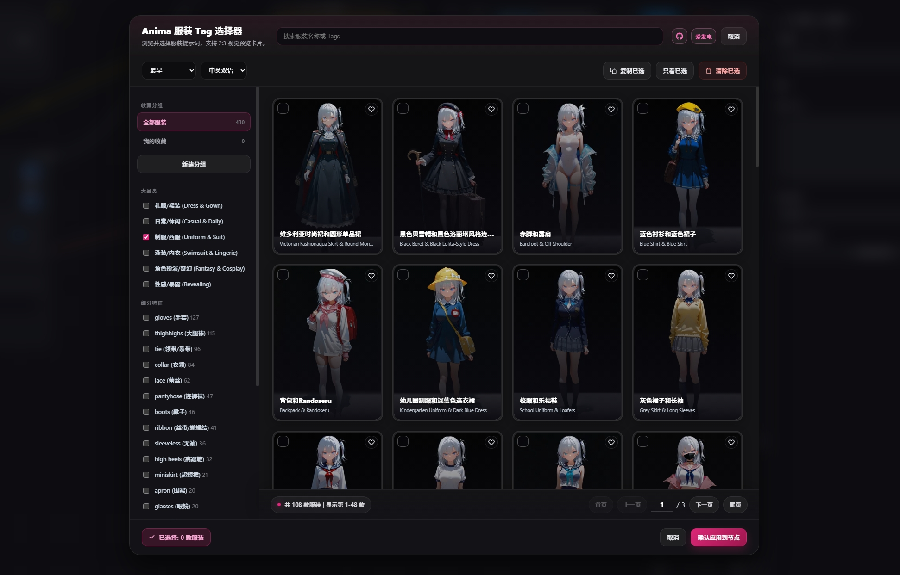
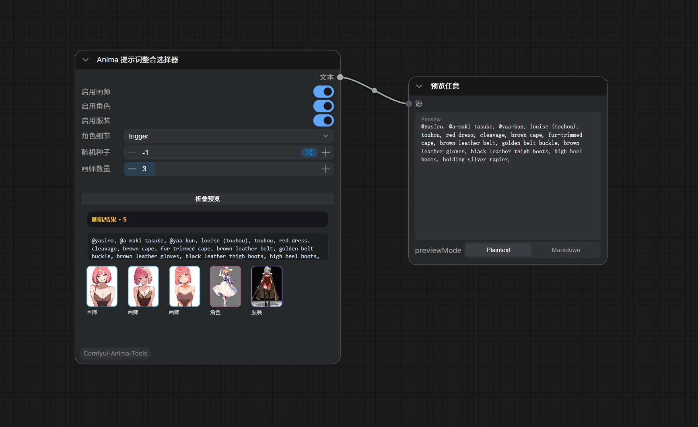

# Anima-Tools: ComfyUI Premium Artist, Character, Clothing & LoRA Visual Selector 🎨

<p align="center">
  
  
  
  
  
</p>

<p align="center">
  <strong>专为 ComfyUI 设计的高性能、多维度二次元画师、角色、服装与 Anima LoRA 视觉选择套件</strong>
</p>

<p align="center">
  Anima-Tools 是一款专为二次元（Anime）AI 绘画量身打造的 ComfyUI 视觉提示词与 Anima LoRA 辅助套件。它深度融合了庞大的画师风格库、精细的动漫角色图鉴、服装提示词图库、随机提示词整合节点与 Civitai LoRA 搜索下载面板，帮助创作者以极高的自由度与精确度构建脑海中的二次元画面。
</p>

---

## 🖼️ 视觉预览 (Visual Preview)

> [!NOTE]
> 以下为本套件实际运行时的交互界面截图。安装后即可在 ComfyUI 中获得完全一致的视觉交互体验。

<table>
  <tr>
    <td align="center" width="50%">
      <strong>🎨 画师风格选择面板 (Artist Style Selector Panel)</strong><br>
      <br>
      <em>图 1. 4万+画师风格库预览，支持独特度与作品数检索排序</em>
    </td>
    <td align="center" width="50%">
      <strong>🎭 角色属性图鉴面板 (Character Tag Selector Panel)</strong><br>
      <br>
      <em>图 2. 多维属性动漫角色图鉴，支持发色、瞳色与同人热度多维交叉过滤</em>
    </td>
  </tr>
  <tr>
    <td align="center" width="50%">
      <strong>🧩 Anima LoRA 加载面板 (Anima LoRA Loader Panel)</strong><br>
      <br>
      <em>图 3. Anima LoRA 搜索、预览、下载、收藏、已加载管理与持久缩略图缓存面板</em>
    </td>
    <td align="center" width="50%">
      <strong>⚙️ ComfyUI 节点示意图 (Workflow & Node Layout)</strong><br>
      <br>
      <em>图 4. 标准版、Plus 版与 Anima Multi LoRA Loader 节点拼装工作流示意图</em>
    </td>
  </tr>
  <tr>
    <td align="center" width="50%">
      <strong>👗 服装标签选择面板 (Clothing Tag Selector Panel)</strong><br>
      <br>
      <em>图 5. 占位图：服装提示词图库预览，支持分类、特征、收藏与自定义项管理</em>
    </td>
    <td align="center" width="50%">
      <strong>🎲 随机提示词整合节点 (Prompt Composer Node Preview)</strong><br>
      <br>
      <em>图 6. 占位图：运行工作流时随机组合画师、角色与服装，并在节点上显示结果预览</em>
    </td>
  </tr>
</table>

---

## 🗺️ 目录 (Table of Contents)
- [✨ 核心功能 (Core Features)](#-核心功能-core-features)
- [⚙️ 安装指南 (Installation)](#-安装指南-installation)
- [📖 节点参数说明 (Nodes Reference)](#-节点参数说明-nodes-reference)
- [📦 项目架构 (Project Structure)](#-项目架构-project-structure)
- [🤝 鸣谢与致敬 (Credits & Acknowledgement)](#-鸣谢与致敬-credits--acknowledgement)
- [📄 开源协议 (License)](#-开源协议-license)

---

## ✨ 核心功能 (Core Features)

### 🎨 1. 画师风格视觉选择器 (Anima Artist Style Selector)
*   **画师底座数据：** 完整收录 **40,000+** Danbooru 精选画师风格（数据基于 [Anima-Style-Explorer](#-鸣谢与致敬-credits--acknowledgement)），支持前端高效检索。
*   **多维检索与排序：** 支持画师名模糊搜索，并可按**作品数量 (Works Count)**、**独特度分数 (Uniqueness Score)** 以及 **字母顺序 (A-Z / Z-A)** 进行快速排序，助你精准定位小众或热门风格。
*   **智能 @ 格式规范化：** 无论在前端交互还是后端 Python 节点，插件都会自动将选中的画师格式化为以 `@` 符号前缀的标准标签（例如选中 `dairi`，自动包装为 `@dairi`），并自动清除多余的 `by ` 或已存在的冗余符号。

### 🎭 2. 动漫角色图鉴选择器 (Anima Character Tag Selector)
*   **多属性高级图鉴：** 深度融合二次元角色百科（数据基于 [AnimaDex](#-鸣谢与致敬-credits--acknowledgement)），内置海量经典与热门动漫角色。
*   **多维度交叉筛选：** 提供**分类浏览面板**，支持按**角色性别**、**发色 (Hair Color)**、**瞳色 (Eye Color)**、**同人热度（插画总数）** 以及 **动漫原作系列 (Hot Series)** 进行交叉检索。
*   **一键应用与清理：** 自动清理角色名字中可能带有的 `@` 字符或多余符号，提供纯净的 Prompts 角色标签输出。

### 👗 3. 服装标签视觉选择器 (Anima Clothing Tag Selector)
*   **服装提示词图库：** 内置服装与穿搭相关提示词数据，支持中英双语展示、Prompt Tags 快速复制与一键应用。
*   **分类与特征筛选：** 支持按礼服、日常、制服、泳装、奇幻、性感等大类，以及蕾丝、露肩、长靴、吊袜带等细分特征快速定位。
*   **收藏与自定义项：** 支持用户收藏分组、自定义服装项与备注式管理，便于沉淀常用穿搭模板。

### 💻 4. 规范的前端交互设计 (Frontend UI Design)
*   **3:4 黄金比例预览卡片：** 贴合动漫人像、立绘和 CG 的美学比例。带有平滑的 Hover 缩放微动效以及阴影表现。
*   **精准分页与页码直达：** 分页控制器直观显示当前页数与总记录。特设页码直接跳转输入框，输入页码按回车即可直达。
*   **多源 CDN 智能切换：** 提供 `JsDelivr`、`GitHub Raw` 和 `Statically` 等多条图片 CDN 通道，用户可在面板中自由切换，确保样图快速加载。

### 🎲 5. 随机提示词整合节点 (Anima Prompt Composer)
*   **运行时自动随机：** 工作流运行到节点时自动从全量画师、角色与服装数据中随机选择内容，不包含用户自定义项。
*   **统一字符串输出：** 输出顺序固定为 **画师 -> 角色 -> 服装**，可单独禁用任意类别；角色支持 `trigger` 或 `trigger + tags` 两种输出模式。
*   **节点内可折叠预览：** 节点上直接显示随机结果的文字提示词与 3:4 图片预览，并支持折叠隐藏预览区域。

### ⚙️ 6. 智能 Python 后端拼接 (Selector Plus Nodes)
*   **双版本节点组合：** 提供基础版 (Selector) 与 Plus 版 (Selector+)。
*   **智能防冲突拼接：** Plus 节点支持自定义 `extra_text`（额外文本）与 `separator`（分隔符）。当两段文本拼合时，系统会自动进行去污与去重，**避免产生双逗号或首尾多余空格**的排版问题，保证工作流稳定。

### 🌐 7. 原生多语言跟随 (Native i18n)
*   支持中英双语，自动识别并实时跟随 ComfyUI 原生的多语言设置（`Comfy.Locale`），无需手动配置。

---

## ⚙️ 安装指南 (Installation)

### 方式一：通过 ComfyUI Manager 自动安装 (推荐)
1. 打开 ComfyUI 界面，点击右下角的 **Manager** 按钮。
2. 选择 **Custom Nodes Manager**，在搜索框中输入 `Anima Tools`。
3. 点击 **Install**，等待安装完成后重新启动 ComfyUI。

### 方式二：手动 Git 克隆安装
1. 打开终端。
2. 进入您的 ComfyUI 自定义节点目录：
   ```bash
   cd ComfyUI/custom_nodes/
   ```
3. 执行 Git 克隆指令：
   ```bash
   git clone https://github.com/nregret/Comfyui-Anima-Tools.git
   ```
4. 重新启动 ComfyUI 即可自动加载。

> [!TIP]
> **零依赖保证：** 本插件基于纯前端 JavaScript 交互与原生 Python 开发，**不需要**通过 `pip install` 安装任何额外的第三方 Python 库，不影响您的本地虚拟环境稳定性。

---

## 📖 节点参数说明 (Nodes Reference)

本套件共提供 8 个核心节点，放置于 `AnimaArt` 分类目录下：

### 1. 🎨 Anima Artist Tag Selector & Selector+ (画师选择器)
*   **基础版 (Selector):**
    *   `artist_tags` (String): 前端交互界面自动填入的画师列表。
    *   `mode` (Combo: `append` / `override`): 在提供可选输入 `opt_prompt` 时，画师名是**追加**到已有提示词后面还是直接**覆盖**输出。
    *   `opt_prompt` (String, 可选输入): 外部传入的已有提示词。
*   **增强版 (Selector+):**
    *   `artist_tags` (String): 自动生成的以 `@` 开头的画师标签。
    *   `extra_text` (String): 用户自定义写入的额外 Prompts / Tag 文本。
    *   `separator` (String, 默认 `, `): 连接画师与额外提示词的分隔符，具有智能排版防错机制。

### 2. 🎭 Anima Character Tag Selector & Selector+ (角色选择器)
*   **基础版 (Selector):**
    *   `character_tags` (String): 前端交互选择填入的动漫角色 Tag 列表。
    *   `mode` (Combo: `append` / `override`): 外部 Prompt 拼接模式。
    *   `opt_prompt` (String, 可选输入): 外部传入的已有提示词。
*   **增强版 (Selector+):**
    *   `character_tags` (String): 选择的角色提示词（去污处理后）。
    *   `extra_text` (String): 追加的自定义提示词。
    *   `separator` (String): 智能防错连接符。

### 3. 👗 Anima Clothing Tag Selector & Selector+ (服装选择器)
*   **基础版 (Selector):**
    *   `clothing_tags` (String): 前端交互选择填入的服装 Prompt Tags。
    *   `mode` (Combo: `append` / `override`): 外部 Prompt 拼接模式。
    *   `opt_prompt` (String, 可选输入): 外部传入的已有提示词。
*   **增强版 (Selector+):**
    *   `clothing_tags` (String): 选择的服装提示词（去污处理后）。
    *   `extra_text` (String): 追加的自定义提示词。
    *   `separator` (String): 智能防错连接符。

### 4. 🎲 Anima Prompt Composer (随机提示词整合器)
*   `enable_artist` / `enable_character` / `enable_clothing` (Boolean): 控制画师、角色、服装三个类别是否参与输出。
*   `character_detail` (Combo: `trigger` / `trigger_tags`): 控制角色输出仅使用触发词，或使用触发词加完整特征。
*   `seed` (Int): `-1` 表示每次运行自动随机；固定数值可获得可复现结果。
*   `artist_count` (Int): 控制随机画师数量；角色与服装固定各随机 1 个。
*   `preview_collapsed` (Boolean): 控制节点上的随机结果预览是否折叠。
*   输出为单个 `STRING`，顺序固定为 **画师 -> 角色 -> 服装**。

### 5. 🧩 Anima Multi LoRA Loader (多 LoRA 加载器)
*   `model`: ComfyUI 标准模型输入。
*   `lora_list_json` (String): 前端 LoRA 选择器维护的 LoRA 列表，包含文件名、启用状态与模型强度。
*   前端面板支持本地 LoRA 预览、Civitai 搜索、下载进度、收藏、持久缩略图缓存与快速二次打开。

---

## 📦 项目架构 (Project Structure)

```text
Anima-Tools/
├── __init__.py                # 插件注册入口与前端静态 Web 资源声明
├── nodes.py                   # Python 核心后端（包含画师、角色、服装、随机整合与 LoRA 加载等）
├── anima_lora_api.py          # Civitai LoRA 搜索、下载与配置持久化
├── README.md                  # 说明文件
├── js/
│   ├── anima_artist_selector.js     # 画师风格视觉选择器前端核心面板交互逻辑
│   ├── anima_character_selector.js  # 角色图鉴选择器前端核心属性检索与交互面板
│   ├── anima_clothing_selector.js   # 服装提示词选择器前端核心面板交互逻辑
│   ├── anima_prompt_composer.js     # 画师、角色、服装随机整合节点预览逻辑
│   ├── anima_lora_selector.js       # 多 LoRA 搜索、下载、本地预览与缓存面板
│   ├── anima_image_utils.js         # 共享图片加载缓存工具
│   ├── anima_promo_links.js         # GitHub 与爱发电跳转入口共享组件
│   ├── data.js                      # 40,000+ 详尽画师数据库 (含 CDN 映射与独特度评分)
│   ├── character_data.js            # 动漫角色发色、瞳色、作品系列、同人热度多维数据库
│   ├── clothing_data.js             # 服装提示词与预览图数据库
│   ├── character_official_data.json # 角色官方触发词与完整特征数据
│   └── i18n.js                      # 多语言智能切换路由 (跟随 Comfy.Locale)
└── locales/
    ├── en/
    │   ├── main.json
    │   └── nodeDefs.json      # 节点定义与英文本地化翻译
    └── zh/
        ├── main.json
        └── nodeDefs.json      # 节点定义与中文本地化翻译
```

---

## 🤝 鸣谢与致敬 (Credits & Acknowledgement)

本插件能够诞生并具备如此庞大且详实的数据支撑，离不开以下杰出的二次元开源项目：

1.  **[AnimaDex](https://github.com/zetaneko/AnimaDex)** 🎭
    *   **致谢理由：** 提供了优质的动漫角色数据库与多维属性图鉴系统。本插件的角色多维度检索筛选（性别、发色、瞳色、同人热度、系列分类）核心数据结构与设计灵感来源于此。
2.  **[Anima-Style-Explorer](https://github.com/ThetaCursed/Anima-Style-Explorer)** 🎨
    *   **致谢理由：** 提供了非常详尽的 **40,000+** Danbooru 画师数据库，让画师风格选择器拥有了坚实的数据根基。
3.  **CircleStone Labs** 🧪
    *   **致谢理由：** 感谢推出杰出的 **Anima 2B** 开源二次元大模型，正是由于该模型在二次元大模型领域的探索，激发了我们打造这款高效率提示词辅助工具的灵感。

> 我们对所有致力于丰富 AI 绘画生态、为开源社区无私奉献的创作者和开发者们致以诚挚的敬意！

---

## 📄 开源协议 (License)

本项目基于 **[MIT License](LICENSE)** 协议开源。您可以自由地使用、修改和分发本项目，但请保留原作者的版权声明与上述致谢声明。
