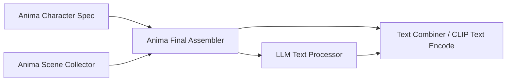

# ComfyUI Anima Tools Hub

ComfyUI Anima Tools Hub 是一組面向動漫圖片工作流的 ComfyUI 自訂節點與前端工具。它把畫師、人物、服裝、背景、姿勢、構圖、表情、光線、LoRA 與 prompt 組合流程集中到同一套 Hub 介面，讓選 tag、複製 tag、收藏、隨機、套用到指定節點都更直接。

這個 fork 目前以新的 Anima Tools Hub 為主要入口。舊 selector 節點仍保留，按鈕會開啟新的 Hub，既有工作流可逐步遷移。


## 功能總覽

| 功能 | 說明 |
| --- | --- |
| Anima Tools Hub | 集中管理畫師、人物、服裝、背景、姿勢、構圖、表情、光線與自定組合 |
| 卡片式瀏覽 | 圖片滿版展示，滑鼠移入後顯示 Trigger、Tags、複製、套用、收藏、編輯 |
| 我的最愛 / Selected | 可在側邊子分類中查看收藏卡片，也可查看目前已選卡片 |
| Apply to Target | 將所有分類已選內容一次套用到目前工作流中的對應節點欄位 |
| 自定卡片 | 使用者可新增卡片、上傳圖片、設定標題、Trigger、Tags、分類歸屬 |
| 自定組合 | 可把多個分類已選卡片存成一張組合卡，之後一鍵分發回各分類欄位 |
| Prompt Builder | 提供 Character、Scene、Final Assembler 三段式 prompt 組合節點 |
| 隨機開關 | selector 與 prompt builder 節點可在執行時自動抽取對應分類 |
| LoRA 工具 | 提供 LoRA 載入、預覽、管理與部分 Civitai 搜尋流程 |

## Hub 分類

目前 Hub 內建這些大分類：

- `画师`
- `人物`
- `服装`
- `背景`
- `姿势`
- `构图`
- `表情`
- `光线`
- `自定组合`

服裝、背景、姿勢、構圖、表情、光線可透過側邊子分類篩選。使用者也可以新增自己的小分類，再把自定卡片歸類到這些小分類。

## Hub 卡片操作

卡片在未 hover 時只顯示圖片、標題和必要副標題。滑鼠移入後會顯示詳細操作：

- 收藏或取消收藏
- 放大圖片
- 切換第二張範例圖
- 選取或取消選取
- 複製 Trigger 或 Trigger + Tags
- 直接編輯 Trigger / Tags
- 自定卡片可重新編輯標題、Trigger、Tags、圖片與分類
- 自定卡片可刪除

畫師與人物卡片保留 Danbooru 連結。其他分類的卡片已移除 Danbooru 按鈕，操作區更集中。


## Prompt Builder 節點

目前建議使用三段式節點：



### Anima Character Spec

用來整理單一角色內容，輸出 `Character`。

欄位包含：

- `name`
- `appearance`
- `clothes`
- `expression`
- `action`

節點下方有 Hub 按鈕與隨機開關。角色名、服裝、表情、姿勢可分別隨機。

### Anima Scene Collector

用來整理場景內容，輸出 `scene`。

欄位包含：

- `background`
- `lighting`
- `composition`

節點下方有 Hub 按鈕與隨機開關。背景、光線、構圖可分別隨機。

### Anima Final Assembler

用來組合最終 prompt。

入口包含：

- `scene`
- `character1`
- 動態增加的 `character2 / character3 ...`
- `tags`
- `lora_trigger`
- `artist`

出口包含：

- `prompt_string`：完整 prompt，包含 tags、lora_trigger、artist、character、scene，結尾會保留空白行，方便再接 LLM 自然語言。
- `content_string`：只輸出 character + scene，可接給 LLM 生成自然語句。

`lora_trigger` 和 `artist` 都以裸行輸出，不額外加欄位名稱。

## LLM 工作流接法

常見接法：

```text
Anima Character Spec -> Anima Final Assembler.character1
Anima Scene Collector -> Anima Final Assembler.scene
Anima Final Assembler.content_string -> LLM Text Processor.prompt
Anima Final Assembler.prompt_string -> TextCombinerTwo.text1
LLM Text Processor.RESPONSE -> TextCombinerTwo.text2
TextCombinerTwo.text -> CLIP Text Encode positive
```

`prompt_string` 會保底在尾端輸出空白行，避免 LLM 回覆貼到 `composition` 尾巴。

## 自定卡片與自定組合

自定卡片支援：

- 自由新增標題
- 設定 Trigger
- 設定 Tags
- 上傳圖片
- 指派到現有或自訂小分類
- 後續重新編輯
- 刪除

自定組合支援：

1. 在多個分類中選取卡片。
2. 點右下角 `新增自定组合`。
3. Hub 會在 `自定组合` 大分類建立一張組合卡。
4. 一開始沒有取名、沒有圖片、沒有子分類時，卡片只顯示 `No image`。
5. 後續可上傳圖片、取名、修改 Trigger / Tags、指派小分類。
6. 選取組合卡後按 `Apply to Target`，會把組合內保存的畫師、人物、服裝、背景、姿勢、構圖、表情、光線分別套用回對應欄位。

## 隨機功能

隨機開關對應欄位如下：

- 畫師隨機到 artist 欄位
- 人物隨機到 name 欄位
- 服裝隨機到 clothes 欄位
- 表情隨機到 expression 欄位
- 姿勢隨機到 action 欄位
- 背景隨機到 background 欄位
- 光線隨機到 lighting 欄位
- 構圖隨機到 composition 欄位

每個隨機開關旁有 `范围` 小按鈕，可選擇「全部」、`我的最愛`、多個子分類，或 `自定组合` 群組下的組合與小分類。面板支援搜尋，也會讀取使用者新增的自定小分類。沒有選擇子分類時會維持原本全部資料抽取。工作流執行後，本次抽到的結果會回填到對應欄位。

## LoRA 工具

LoRA 相關工具包含：

- 本地 LoRA 掃描
- LoRA 預覽圖
- 遠端預覽快取
- Civitai 搜尋與資料輔助
- 多 LoRA 載入節點

## 安裝

將此 repo 放到 ComfyUI 的 `custom_nodes` 目錄：

```bash
cd ComfyUI/custom_nodes
git clone https://github.com/j955229/Comfyui-Anima-Tools-HUB.git
```

重新啟動 ComfyUI 後，在節點選單中尋找 Anima Tools 相關節點。

## 主要檔案

```text
nodes.py                         Python 節點與後端 API
anima_lora_api.py                LoRA 管理與預覽 API
js/anima_hub.js                  Anima Tools Hub 主介面
js/anima_prompt_builder.js       Prompt Builder 節點前端按鈕與動態角色入口
js/anima_artist_sources.js       Theta / Mooshie / Merged 畫師來源
js/anima_character_sources.js    Animadex 人物來源
js/anima_taxonomy.js             分類與子分類規則
js/anima_target_resolver.js      Hub 套用目標解析
js/*_data.js                     Hub 卡片資料與提示詞資料
img/hub/*                        Hub 內建範例圖片
ComfyUI user/anima_tools/uploads 使用者新增卡片的壓縮圖片
```

## 資料來源與致謝

- [AnimaDex](https://github.com/zetaneko/AnimaDex)：人物資料來源與人物卡片互動參考。
- [Anima-Style-Explorer](https://github.com/ThetaCursed/Anima-Style-Explorer)：Theta 畫師資料來源。
- [Anima-Assets](https://github.com/ThetaCursed/Anima-Assets)：部分畫師圖片資產來源。
- [Mooshie Anima](https://anima.mooshieblob.com/)：Mooshie 畫師資料與卡片切換互動參考。
- [AnimaTags-DB](https://github.com/nregret/AnimaTags-DB)：背景、姿勢等 tag 與圖片資料來源之一。
- [Dressing-doll](https://github.com/nregret/Dressing-doll)：服裝圖片與 tag 資料來源之一。
- [Civitai](https://civitai.com/)：LoRA 查詢與預覽資料來源之一。
- 原始 ComfyUI Anima Tools 專案與相關節點設計。

## 授權

本 fork 依原專案授權延續。使用前請同時確認原專案、資料來源與各外部服務的授權條款。
